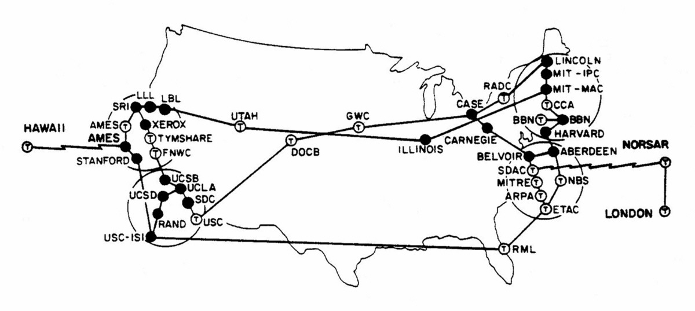

# Digital structure

Welcome!

<!-- This session is going to focus on __how__ the internet works, what are the protocols that define it, what are the people that have designed it and what are the organizations that maintain it.

In a second part, we will focus on an introduction to HTML, CSS and JavaScript. -->

---

## Introduction

---

Last time, we introduced the class, and look at the main components of a web page.

Plan for the session:

- history, protocols and governance of the internet
- more html and css
- groups and projects

---

## Reading

John Perry Barlow, _A Declaration of Independence of Cyberspace_, Davos, 1996.

can the internet escape state regulations?

<!--

Cyberspace is online space.

Being online means being somehow connected to, and interacting with, a network of other people. It's being part of a social group dissimilar from physical social groups: not limited by geographic constraints, but limited by technical constraints.

As for being "free" online, freedom can be associated either to immediate restraints (you *cannot* do that), or to subsequent consequences (you *should not* do that). The "spontaneous" and "worldwide" development (or so it seemed) of the internet made the early users feel that there was some ineluctability to the spread of communication, knowledge and information, as illustrated by the motto "information wants to be free". The free production and circulation of information necessitated, however, a readjustment of how we write and read things.

The other component is anonymity. At some point, it was impossible to know who was saying what, and instead of a terrifying nightmare of potential terrorist activity that this would be seen as in the 21st century, this was considered an opportunity to erase all inequalities: race, gender, income, etc. Whenever you're online, the only thing that matters is what you know, and what you say. In practice, however, most of the early internet users were young white males from the US.

The first appearance of the term cyberspace is in William Gibson's sci-fi novel Neuromancer, which had a huge impact on pop culture then, and now (e.g. The Matrix was heavily influenced by the style and world of Neuromancer). In this novel, groups of self-organized individuals, hackers, travel in a digital (yet, three-dimensional) world in order to fight against the oppression of corporations. Cyberspace, then, is first and foremost a fantasy. But this fantasy has roots in deeper, broader dreams: the New Frontier, the communes of the 1960s and early libertarian thinking.

If cyberspace claims to be independant, than independant from what? For Barlow, it's obviously being independent from nation-states, but as we have seen last week, there are different forces at play when it comes to the development of technology: governments are one of them, along with the military and commerce, but there are also two others: academica, and us. This week is going to specifically address the influence of those groups on the development of the internet.

Yet, the Internet is made and used by people, and people are subjects of states.

-->

---

The clash between east and west codes[^ref-lessig].

[^ref-lessig]: Lessig, Lawrence. _Code and Other Laws of Cyberspace_. Basic Books, Inc., 1999. <https://lessig.org/product/code/>

<!--

There is a clash between two kinds of normativities: the legal (the "shall") and the technical (the "can"). This idea is further developed by Lawrence Lessig in his book `Code Is Law`.

The west coast code acts as law insofar as it is always either allowing or denying a particular state or behaviour. Without code, in the cyberspace, there is nothing; no jurisprudence, only decrees. To those two forces, we can also add the cultural and the economical.

The question, then, is not whether or not we can be independent from external forces in cyberspace, but rather how do we actually hold accountable the forces that do.

Overall, the interaction between technology and society lies in this tension between what technology wants and what humans want. To undestand diigtal technology, we also need to trace its history.

-->

---

## Internet history

---

What's the difference between the Internet and the Web?

<!--

The development of the Internet precedes that of the Web by about 20 years. The internet therefore provides the infrastructure to enable the Web, and a lot of other applications (email, file transfer, torrenting, etc.). While the Internet was explicitly funded by the U.S. military, the Web was funded by the CERN, a nuclear research agency in Switzerland.

tl;dr: the Web runs on the Internet.

-->

---


<!--

The ancestor of the Internet is the ArpaNet (Arpa is the R&D branch of the U.S. military) is first setup in 1969 across a few computers located on different university campuses.

This network was first and foremost the product of research in the field of machine communications: if phone lines weren't good enough for multiplexing (aka many-to-many communication), they needed to find something else. That something else became packet-switching, a technique which enables messages to take multiple, independent routes. Like the telegraph, it transmits data. But it does so automatically, and for multiple terminals at once.

The diagram above is the earliest Internet known, and indicates who (universities: UC Los Angeles, UC Santa Barbara, Stanford Research Institute and University of Utah) is running what kind of computers).

-->

---



<!-- THe growth of the internet is just more and more computers connected to each other -->

---


<!--

the web was built on top of the internet, by tim berners-lee (CERN) in 1989.

he was part of the people who designed HTTP, HTML. HT stands for HyperText, and it's focus is on sharing documents across computers.

-->

---

## Internet protocols

---


Mapping the Internet is assigning IP addresses.

<!--

The internet is a collection of computers which all have a single IP (Internet Protocol) address. See https://ipv4.dev.sarl/@zoom=2 for an interactive visual.

The internet then delivers content between IP addresses. For instance, WhatsApp is an example of VoIP (Voice over IP).

-->

---


[Undersea cables](https://www.submarinecablemap.com/) are the backbone of the Internet, and the object of geo-economical contention[^ref-blum-baraka].

[^ref-blum-baraka]: Blum Andrew, Baraka Carey, _Sea change_, Rest of World, 2022 <https://restofworld.org/2022/google-meta-underwater-cables/>

<!-- The internet is not a cloud, its mostly a collection of subsea cables operated by large companies. This is also changing with Starlink. For a more holistic map of Internet geopolitics, see: https://www.cartografiasdainternet.org/en

But, as a series of cables, it's also [very fragile](https://www.bbc.com/future/article/20240724-the-day-the-internet-turned-off).

-->

---

The internet (and the web) can also be considered as a bunch of standards:

- tcp/ip -> addresses (machine version)
- dns -> addresses (human version)
- http/smtp/ftp/irc -> application
- html -> display instructions

---

_how do i know where i'm going, and how to get there?_ __internet protocol!__

_how do we make sure that whatever we're sending gets there in one piece?_ __transmission control protocol!__

you identify people online by their IP.

<!-- IP (Internet Protocol) is the set of behaviours which allows to know where a computer is on a network. It is essentially an address system along with a network of roads. In an example of going from A to B, it first defines what it means to be A, and to be B (i.e. it assigns addresses, of the type 127.234.231.9), and then it establishes multiple paths between A and B, by breaking up a given message from A to B and having different parts of that message go through different paths to get to their destination.

The job of TCP, then, is to make sure that, once those packets have gotten to B, none of them are missing, and they can be reliably re-assembled in order to make sense of that message. It does so by structuring the data in a very particular way (see resources for a detailed explanation).

Those two protocols were designed by Vint Cerf and Bob Kahn at UCLA in 1967, and the first packet sent according to these protocols was sent on October 29, 1969. Their message actually crashed the whole network. In contrast, the response to the first message ever sent via the telegram was "What Hath God Wrought?" -quite visionary for the time, courtesy of Graham Bell's daughter. -->

---

_how the hell am i supposed to remember all these numbers?_ __domain name system__

wikipedia.org -> 208.80.153.224

there are special ["phone books"]((https://www.internetexchangemap.com/#/)) computers which keep track of the IPs.

<!-- Because IP addresses are just numbers, the DNS protocol convert these numbers in human-memorable means: words, separated by dots. It starts with a TLD (top level domain), such as __com__, then goes down one level, such as __google__, then another level, such as __mail__, for a complete Domain Name of __mail.google.com__ -->

---

_how do i know the correct way to interpret a message?_ __hypertext__ transfer protocol

(other protocols on the application layer: simple mail transfer protocol (SMTP), file transfer protocol (FTP), etc., HSTS)

<!-- HTTP is the protocol in which "clients" and "servers" first appear. It functions as a request, and a response, in order to fetch some information through some automated way from a remote machine. -->

---

All this to send an HTML file.

It's a file written __hypertext markup language__, which describes a document, that can be found at a place specified by a __universal resource locator__

<!-- This is where we technically leave the realm of the internet and get into "userland", the realm of humans, and what we see on our screens. HTML is what we usually call a webpage, and it is not separable from the development of HTTP, since HTTP was designed to retrieve HTML documents.

HTML documents, ML meaning Markup Language, is a way to organize information in a consistent way so that it can be retrieved reliably. Previous inspirations include Ted Nelson's Xanadu project, and Vanevar Bush's Memex -->

---

a typical day in the life of the web:

0. a __client__ asks  for a webpage to a __server__.
1. they type the URL, and DNS translates it into an IP address
2. your computer sends a HTTP request to that IP address (visualize [the route](https://geotraceroute.com/))
3. the `server` sends back a HTTP response (with an HTML document) to the `client`
4. the `client` (your computer) has a browser which interprets the document according to the HTML rules

---


---

## Internet governance

So who's in charge of all this?

---

In the 1980s, governance of the internet leaves the control of the US military, the NSF, and the US Chamber of Commerce, for:

ISoc - __Internet Society__ - think tank

IETF - __Internet Engineering Task Force__ - infrastructure (operates via [rough consensus](https://en.wikipedia.org/wiki/Rough_consensus))

W3C - __World Wide Web Consortium__ - content on web

ICANN - __Internet Corporation for Assigned Names and Numbers__ - addresses

---

commitment to multilateralism:

- private companies
- research universities
- professionals' associations
- governments

(list of all [members of the W3C](https://www.w3.org/Consortium/Member/List))

---

The main challenges of these organizations are __reliability__[^ref-denardis], __net neutrality__[^ref-schafer-musiani] and __encryption__.

[^ref-denardis]: DeNardis, Laura, _Protocol Politics: The Globalization of Internet Governance_, MIT Press, 2008. <https://mitpress.mit.edu/9780262526753/protocol-politics/>

[^ref-schafer-musiani]: For more on the net neutrality debate, see Schafer, Valérie, et al. "Net Neutrality: An Issue of Democracy." Transforming Politics and Policy in the Digital Age, edited by Jonathan Bishop, IGI Global Scientific Publishing, 2014, pp. 22-38. https://doi.org/10.4018/978-1-4666-6038-0.ch003

---

But governments nonetheless still play a role, such as in the RuNet[^ref-runet], SneakerNets[^ref-sneakernet], or the Great Firewall[^ref-great-firewall].

[^ref-runet]: The Russian internet <https://en.wikipedia.org/wiki/Runet>

[^ref-sneakernet]: Among others, the Cuban or North Korean internets <https://en.wikipedia.org/wiki/Sneakernet>

[^ref-great-firewall]: The limitation between Chinese and non-chinese internets <https://en.wikipedia.org/wiki/Great_Firewall>

---

## Group formation

---

Quick recap for the group inquiry

1. a starting topic (a hunch, some curiosity)
2. literature review (did anyone already research this?) <- -> research questions (what is it that i want to know, exactly? what are some questions that are still left open?)
3. hypothesis (that's my starting assumption, which doesn't matter if it's wrong or right or both)

---

1. tell us one or two topics you would like to work on
2. go to this [miro board](https://miro.com/welcomeonboard/MUd4RmtDYWtYNTdHZXBPN21aUGJkRVJEbzdxT0k4dWt3eDZUc2h5REpYUGRGSTBBTmhQSGxPUjhMckxoYUJzZnwzMDc0NDU3MzUxNjExNTgxMzcxfDI=?share_link_id=524781044592)
3. write down the topics by adding a sticky note (don't forget to mention your name!)
4. topics coalesce into groups!

---

## Web languages

---

webpages are written in __HTML__.

hyper text markup language

a markup language is a language which describes __what__ the content is, with _tags_.

`<tagname attribute="value">` innerText `</tagname>`

`<p class="introduction">` Lorem ipsum dolores sit amet... `</p>`

---

every webpage has minimum three tags: `<html>`, a `<head>` and a `<body>`

`<head>` is what your browser needs to know, and includes all the files needed to display the page correctly (e.g. the CSS files, or the scripts that spy on you)

`<body>` is what you want to see

most of your work will be inside the `<body>` tag.

---

webpages are formatted with __CSS__ (cascading style sheets)

a style sheet is a document which indicates __how__ things should look

```css
selector { 
attribute: value;
}

p {
color: green;
}
```

---

## Outro

---

Our digital communications provide us with seemingly __global information exchange__ (it goes very fast and treats everyone the same), but still __relies on material infrastructures and political agreements__.

---

Next time, we talk about the origins of social media.

read [radical opacity](https://www.technologyreview.com/2010/08/23/200890/radical-opacity/), where we learn about the origins of 4chan.
