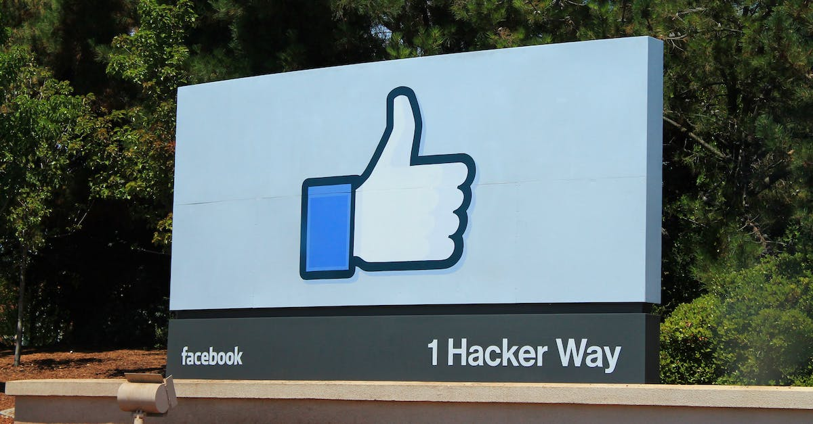
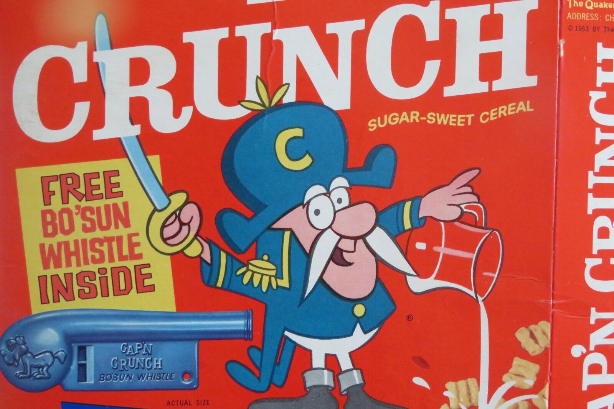

# Digital sociability

Welcome!

---

## Introduction

Last session, we looked at how the Internet and the Web came to function, how they transport information theoretically and materially.

Now we start to shift to how _people_ use the internet.

Plan for the session:

- hackers
- social media
- group work

<!-- The main question of the two upcoming session is: how did we get to the social media we have today? To do that, we will trace back a history of online participation and socialization, starting with hackers and phreakers.

We will then look at how we've translated social performance online. What were the first forms of sociability on the internet, and how did these forms of sociability evolve to form the landscape of 'social media' as we see it today? We'll move through history from hackers to participative web to monolithic social networks.

Then, we will turn to the more classical understanding of political organization, with a particular focus on how digital technologies allow for the emergence of new forms of power structures, and how they reinforce existing means of control. -->

---

## Hackers

---

What is hacking? Who is a hacker?

---

Hacking means experimenting with the capabilities of a system in order to better understand/exploit it, without paying attention to "how it is supposed to be done".

---

<!-- One hack that facebook did was the [facebook emotional manipulation experiment](https://www.theatlantic.com/technology/archive/2014/06/everything-we-know-about-facebooks-secret-mood-manipulation-experiment/373648/). -->

---

<!-- Hackers are preceded by phreakers, such as [Cap'n Crunch](https://classic.esquire.com/secrets-of-the-blue-box/), who exploited telephone lines to bypass the arbitrary fees of the phone company (up until 1982, the Bell System, which owned AT&T, had monopoly over telephone communications in the US). One of those phreakers was Steve Wozniak, the creator of the first Apple computers, see [phone phreaking and the little blue box](https://www.slate.com/articles/technology/the_spectator/2011/10/the_article_that_inspired_steve_jobs_secrets_of_the_little_blue_.html) -->

---

sharing of infomation between early users happened on the proto-social media[^ref-levy]:

- usenet
- bbs

the motto was that _information wants to be free_ (but should it?)

[^ref-levy]: Levy, Steven. _Hackers: Heroes of the Computer Revolution_. O’Reilly Media, Inc., 2010.

<!--

Which is a technical twist on the claim for freedom of speech, coupled with some desire for knowledge. If knowledge is free, anyone can learn, and anyone can become skilled.

These social practices of hacker culture and the associated ethos of closed-source/open-source, proprietary/free software, are closely intertwined with the the means of communication, whether how they created these cultures, and how these cultures created them.

One the one side, you have things like the early communication systems: SSH, BBS, Usenet, IRC, etc. These were designed to allow for interaction between the participants (except for SSH, which allowed multiple people to use the same machine at the same time), and followed the design of a public message board, or a public chat. It took the web sometime to integrate these models of communication to its architecture (the web was originally made to serve static, non-interactable content). The switch towards a more user-friendly web (one with comments, wikis, blog posts, etc.) has led to what is called the __Web 2.0__.

On the other side, the hacker ethos transpired into some of the largest commercial digital products of our times. Products like MySpace, Facebook, AirBnB or Uber stand in the direct tradition of "hacking", and most companies and institutions now organize "hackathons", associating the practice with a sort of brainstorming. The terms disruption, hack, break, find their roots in these communities.

-->

---

in the late 1980s, the Web takes over static delivery of content.

but you still need to have the skills to know server administration, network configuration, writing html, etc.

at this point, mark zuckerberg is a toddler.

<!-- The next step in developing a presence online is the "homepage", where websites looked like [this one](https://phrack.org/issues/7/3#article) -->

---

a next step is the development of __the web 2.0__[^ref-oreilly]

- lower barrier to entry
- dynamic/multimedia content (google maps and youtube)
- social interaction (comments)

[^ref-oreilly]: O’Reilly, Tim. “What Is Web 2.0?” O’Reilly, 30 Sept. 2005, <https://www.oreilly.com/pub/a/web2/archive/what-is-web-20.html>.

<!-- With the Web 2.0, you don't need to know much about computers to be able to publish online. -->

---

examples of journalistic blogs:

- [indymedia](https://indymedia.org/)
- [oh my news](www.ohmynews.com)
- [rue 89](https://www.nouvelobs.com/rue89/)
- [breitbart](https://www.breitbart.com/)

<!-- All of these are _technically_ blogs: they don't need a printing press or a traditional distributor to reach their audiences. Just a single computer is necessary.

Hackers and the hacker ethos laid out the foundation for new and complex phenomena: the participative web, and social media. The switch to the Web 2.0 is then a switch in scale and usability. It becomes easier to edit things live, to set-up complex systems like a blog or a personal page, and to interact with webpages in ways that were either new or previously restricted to non-web systems (e.g. google maps, google drive, etc.). The Web 2.0 became emblematic by the platforms that appeared: MySpace, Wikipedia, YouTube, Facebook et. al.). Anyone can now theoretically say anything to anyone else. Information is free.

One of the first manifestations of these new possibilities is the creation of cultural groups online. With the streamlining of information sharing, and the reduction of friction in user interfaces and user experiences, sub-cultures started to develop (around Second Life, MySpace, Tumblr, etc.), around shared tastes, interests and activities. Exclusively-online cultures, such as MUDs (Multi-User Dungeon), which have been around as early as the 80s are now a possibility, and individuals are no longer restricted by lack of access or geographic remoteness.

This abundance of access has another consequence. It is no longer necessary to ask permission from traditional content-producers (e.g. newspapers) in order to publish and discuss something. Social media (like IndyMedia, Ohmynews, Rue89) were set-up in order to bypass the censorship and barrier to entry in existing dominant media. The result of this lack of moderation isn't always the magical appearance of high-quality content, but rather a complicated intertwining of broad tendencies, existing cultural agendas and economic incentives. 

-->

---

this participative web implies a multi-level dynamic:

- construction -> contribution (user-generated content depends on highly formatted infrastructure)
- fictional -> real (users are sorted based on their email addresses)
- fringe -> mainstream (everyone has access to it)
- niche -> accessible (which makes it feel like the private is becoming public)

<!--

Once all of these technologies are in place, we get what we call "social media". The difference here is that these platforms offer an alternative which switches the focus to the real, identifiable self, and away from the completely fictional personas.

While previous systems (BBS, UseNet, IRC, Wikipedia) are also social networks, the ones we understand by "social network" today are definitely ones that relate to who we are "officially". For example, Facebook and Google are two platforms that have enforced real name policies, and multiple others allow users to be "verified", by establishing a proof of who they are offline, and online.

A social network is therefore a platform in which every user has a personal page, and can interact with other users' personal pages. It is the massification of blogging (doing), combined with the richness of identity building (being).

-->

---

The Web 2.0 also widens modes of communication online, ranging from stances between __doing__ and __being__, and stances between being __fictional persona__ to __official identity__[^ref-cardon].

[^ref-cardon]: See Cardon, Dominique. _Culture numérique_. Presses de SciencesPo, 2019.

<!--

Dominique Cardon has a visual matrix (see context) which maps out the different types of behaviors that can be associated with different locations (platforms). This matrix runs along a DOING <> BEING axis, where doing implies more active contribution and creation of original content, while being implies only (more or less) strategic display of information.

A summary in french can be found here: <https://occitanie-canope.canoprof.fr/eleve/culture-numerique/internet-responsable-enseignants-familles/activities/internet-responsable-enseignants-familles.html>

The development of digital platforms helped create three groups of people which overlapped to significant extents: producers, hackers and consumers. The producers functioned in the very early days in a mode of REAL DOING, that is, their real identities were linked to their actions, which usually resulted in copying, creating or receiving software.

As software became commercialized, and as the difference between (known) professionals and (unknown) amateurs became more clear, hackers started acting within the FICTIONAL DOING, where real identity didn't matter as much. The founder of the Free Software movement, Richard Stallman, was known online by his acronym (RMS) than by his full name.

Hackers and commercial producers then developed a first version of tools which were used for more and more FICTIONAL BEING, along with FICTIONAL DOING. These included blogs, wikis, personal pages and profiles, as well as online game-worlds.

Finally, with the advent of commercial, holistic social media, the tendency pushes even further towards REAL BEING. This doesn't mean that we are all exposed fully all the time, but rather that we acknoweldge that it is no longer the point to project completely fictional personas. Still, if the anonymous actions at some stage of the internet are no longer the reality of the situation, they remain a large inspiration for the internet was and could still be.

-->

---

Ultimately, social media platforms provide technical norms to align with their idea of good behaviour, what Ian Kerr calls __the digital lock as the automation of virtue__[^ref-kerr].

[^ref-kerr]: Kerr, Ian R., and Michael Geist. “Digital Locks and the Automation of Virtue.” From “Radical Extremism” to “Balanced Copyright”: Canadian Copyright and the Digital Agenda, Irwin Law, 2010, pp. 247–304, https://papers.ssrn.com/abstract=2115655.

<!-- For a very radical mode of existing online, see 4chan, and their portrait by MIT on [radical opacity](https://www.technologyreview.com/2010/08/23/200890/radical-opacity/) -->

---

## Group work

---

- refine the topic
- find preliminary research on it
- consider a specific angle on it
- formulate open questions

---

## Outro

---

Social media grew out of a small group of computer enthusiasts who contributed to, and piggibacked on, the development of technologies, with a cultural disdain for tradition.

Ultimately, they enabled highly structured access to online expression for billions of people.

---

Next time, we talk about how activists, governments and corporations use those comunication networks.

read [engineering the public](https://firstmonday.org/ojs/index.php/fm/article/view/4901/4097), where she develops the concept of _computational politics_.
