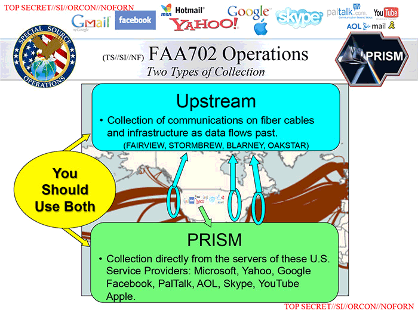

# Digital governance

Welcome!

---

## Introduction

Last session, we talked about social communication from a historical perspective, considered broadly. Now, we focus on political communication.

Plan for the session:

- grassroots political organization
- government control
- javascript and programming

---

## Online activism

---

What is online activism today?

<!-- Is it just about posting informations, is it about coordinating? -->

---

One of the original dream was that of the __online public sphere__[^ref-habermas] [^ref-issue-yale]

<!-- Mostly, public sphere(s) have been understood as communicative spaces where participation is open, where matters of common concern can be discussed and where proceedings are visible beyond their immediate participants. -->

[^ref-habermas]: Habermas, Jürgen (1962 trans 1989) _The Structural Transformation of the Public Sphere: An Inquiry into a category of Bourgeois Society_, Polity, Cambridge.

[^ref-issue-yale]: For a digital take, see the special issue at <https://law.yale.edu/isp/publications/digital-public-sphere>

<!-- Any of these forms of democracies rely on an idea called the "public sphere". The public sphere is a concept developed by Jurgen Habermas in 1962 in which he highlights the distinction between the state and the public arenas of citizen discourse. Politics do not exclusively happen through the state: they happen through semi-formal and informal, speech-based, exchanges between informed citizens (private persons discussing public concerns). The public sphere is to debating and argumenting what the market is to buying and selling. However, while an essential component of democratic life, the public sphere as originally described had some issues: class and gender distinctions, state manipulation due to state welfare (public funding of various institutions, from media to entertainment to unemployment) and the illusion that the bourgeois, liberal public sphere is the only public sphere (disregarding anything dissenting discourse as a valid political discourse).

How does the digital public sphere change that? As we've seen there was a shift between the roles of fictional and real personas online. While fictional personas online used to be understood as tokens of anonymity, and therefore the means to judge someone exclusively on __what__ they had to say, real personas online have brought back the ideas of class and gender distinctions.

While the existence of multiple, dissenting discourse can be seen as a proactive force for democracy, the illusion of one single "sphere" has underestimated the presence of filter bubbles, and qualified them in negative terms instead of working around them to make them communicate. The promise of the digital public sphere was for a long time that "everyone would have their voices heard", but it quickly became the reality that "everyone's voices could be drowned in noise". -->

---

Among hackers, online modes of governance does take place through reasoned (but not always respectful) exchanges, backed by technical skill, through __open-source models__ or __remote-first models__.

People can coordinate and build great things via forums.

---

They can also create revolutions[^ref-tufekci].

The first of which was the Arab Spring, in 2011[^ref-nps].

[^ref-tufekci]: Tufekci, Z. (2017). [Twitter and tear gas: The power and fragility of networked protest](https://www.twitterandteargas.org). Yale University Press.

[^ref-nps]: [The Networked Public Sphere and Civic Engagement in Post-2011 Egypt: A Local Perspective](https://www.arabnps.org/egypt/), Nagla Rizk, Lina Attalah, Nadine Weheba, arabnps.org, 2016.

<!--

Social media has therefore also enabled the development of fringe groups, of those that were not the "traditional" public sphere, from dissidents in Egypt and Iran to white-supremacists and black blocks.

Overall, social media helped with the revolutions insofar as it gave a unity and a visibility to previously isolated voices. It then allowed for precise coordination during specific protest movements (e.g. using Blackberry Messenger in Hong-Kong, Twitter in Egypt and Iran). Additionally, because it was using Western tech, it was particularly mediated in the West, with a feeling of "liberal democracy coming to enlighten backwards countries".

However, it stopped being useful for two reasons: because of the lack of unity required for long-term political organization, and because other political forces entered the online sphere, both directly (creating accounts on these platforms and influencing the objects of discourses on them) and indirectly (understanding the processes through which information is shared, and to whom, in order to act pre-emptively through targeted censorship).

what was the impact of social media in offline 'revolutions'?

- real-time coordination
- feeling of mass-discontent vs. sheep mentality
- critical mass, spreading awareness, fast propagation
- archiving discontent
- bypassing state media

-->

---

What are some social movements that started online? Did they succeed?

<!--

- Black Lives Matter
- Woman, Life, Freedom
- Extinction Rebellion

But communcation is not all.

Social movements go beyond the use of new means of communication. It needs to translate to the ground. It also requires leadership and cracks in the enemy.

They raise awareness, but also get people identified. Back to the double-edged sword.

-->

---

In the meantime, governments adapted:

- limitations in structuring[^ref-hintz]
- targeted actions
- data gathering

[^ref-hintz]: [Restricting Digital Sites of Dissent](https://github.com/pierredepaz/politics-of-code/blob/master/assets/readings/06-people/RestrictingDigitalSitesOfDissent.pdf), Arne Hintz, Critical Discourse Studies, 2016.

<!--

For instance, military in Egypt check people's phones directly in the street for illegal content, and China allows for complaints online, but flags anyone who decides to take to the streets.

-->

---



<!-- See the original report on the extant of the surveillance by the US: [NSA Files Decoded](https://www.theguardian.com/world/interactive/2013/nov/01/snowden-nsa-files-surveillance-revelations-decoded), E. McCaskell, L. Poitras, The Guardian, 2013.

Censorship is only the active phase of a two-part process. The first part is that of surveillance and, again, while it is a political priority which predates the internet, large-scale surveillance was made possible with the advent of digital technologies. While, before, one had to physically follow someone to know what they were up to, or to rely on a network of human informants (HUMINT), contemporary methods have switched towards a tracing of digital signals left in the wake of the surveilled individual's doings (SIGINT).

This surveillance network is composed of three main vectors:
- upstream: the probing of internet cables to directly intercept internet traffic
- downstream: the request for confidential information to cooperating commercial entities
- legal: the use of territorial legal exclusivity in order to access data which transits through the national terrority. since the internet is designed as a distributed system (i.e. a message can potentially go through any node in the network), it is inevitable that any message could enter a legal territory and be subject to its laws (due to the PATRIOT Act).

-->

---


<!-- See the full report on Pegasus here: https://forbiddenstories.org/projects_posts/pegasus-project/, and its geopolitical implications here: https://www.nytimes.com/2022/01/28/magazine/nso-group-israel-spyware.html -->

---

The battle around __encryption__ (aka it's all or nothing).

---

## Computational politics

---

What are _computational politics_?

---

> Computational politics refers applying computational methods to large datasets derived from online and off–line data sources for conducting outreach, persuasion and mobilization in the service of electing, furthering or opposing a candidate, a policy or legislation.

- the rise of big data
- the shift from demographics to individual targeting
- the opacity and power of computational modelling
- the use of persuasive behavioral science
- the dynamic real-time experimentation
- the growth of new power brokers

---

### Election periods

---

The intent is to use computers to push the right buttons. This takes place within a longer history of marketing and politics (e.g. A/B testing).

<!-- If governmental response did take some time to develop, it was mostly because they didn't quite understand the means through which censorship could work in this new ecosystem. While censorship was historically based on specific choke points through which institutions could exert their power (publishing houses, royal approval, etc.).

With the advent of the participative web, it became a lot more complicated to limit the flow of information: no one needed any approval in order to publish something.

The means of government censorship manifested themselves in three different ways:
- first, they realized, through the copyright mechanisms mentioned earlier, that it was possible to leverage the incentives and knowledge of commercial platforms in order to constrain the flow of information and to identify the real personas of posters.
- second, with the ability to identify posters, it became easier to target individual dissenting voices, approaching censorship "from the bottom-up" rather than through blanket prohibition.
- third, state actors have used the new configuration of the digital public sphere to spread disinformation campaigns, a new, computational form of propaganda through which public discourse is hijacked by a heterogeneous assemblage of real and fake social media accounts. -->

---

It came from a desire to do __social engineering__[^ref-weinberg], aka have technical solutions to social problems.

[^ref-weinberg]: Alvin M. Weinberg (1966) _Can Technology Replace Social Engineering?_, Bulletin of the Atomic Scientists, 22:10, 4-8, <https://doi.org/10.1080/00963402.1966.11454993>

<!-- In particular the social credit system in China or the financial credit system in the West. -->

---

One form of social engineering is fake news (misinformation or disinformation)[^ref-berriche]

[^ref-berriche]: Altay, S., Berriche, M., & Acerbi, A. (2023). _Misinformation on Misinformation: Conceptual and Methodological Challenges_. Social Media + Society, 9(1). https://doi.org/10.1177/20563051221150412 (Original work published 2023)

<!--

- methodologically convenient
- fake news vs. entertaining content
- falsehoods spread as fast as truth
- engagement does not mean belief
- uninformed vs. misinformed
- misinformation is overblown

from [Misinformation on Misinformation](https://journals.sagepub.com/doi/full/10.1177/20563051221150412)

truth is a mathematical concept, not a political one

-->

---

- methodologically convenient
- fake news vs. entertaining content
- falsehoods spread as fast as truth
- engagement does not mean belief
- uninformed vs. misinformed
- misinformation is overblown

---

Regarding social engineering through fake news, yochai benkler highlights the difference between evidence of __action__ vs. the evidence of __effectiveness__

[cautionary notes on on disinformation and the origins of distrust](https://mediawell.ssrc.org/expert-reflections/cautionary-notes-on-disinformation-benkler/)

---

### Non-election period

---

Computational politics is also the everyday management of citizens _by machines_.

---

.

The Hollerith machine, proudly counting U.S. citizens since 1890[^ref-ibm-nazi].

[^ref-ibm-nazi]: In particular, see how this technique was exported to counting Jews for the Nazi regime: <https://en.wikipedia.org/wiki/IBM_and_the_Holocaust>

---

Modernity ushered in rational organization of school, life, work[^ref-scott].

[^ref-scott]: Scott, James C. _Seeing like a State: How Certain Schemes to Improve the Human Condition Have Failed_. Yale University Press, 2020.

<!-- e.g parcoursup, social benefits allocation in france, establishment of digital identities -->

---

Financial credit system in the US since the 1970s, Social credit systems in China since the 2010s.

---


Efficient access vs. effective access.

---

Should we have digital identities?

---

A __panopticon__ is a mode of control

It features asymetry of vision, and identification of protagonists, leads to self-governance (or self-censorship).

> Hence the major effect of the Panopticon: to induce in the inmate a state of conscious and permanent visibility that assures the automatic functioning of power. So to arrange things that the surveillance is permanent in its effects, even if it is discontinuous in its action; that the perfection of power should tend to render its actual exercise unnecessary; that this architectural apparatus should be a machine for creating and sustaining a power relation independent of the person who exercises it; in short, that the inmates should be caught up in a power situation of which they are themselves the bearers. [^ref-foucault]

[^ref-foucault]: Foucault, Michel. “Panopticism.” In _Discipline & Punish: The Birth of the Prison_, translated by A. Sheridan, 195-228. Vintage Books, 1995.

<!-- More recently, there has been a more traditional take over of tech billionaire by news media (à la Bolloré). -->

---

## Programming

---

Programming is made up of:

- data
- actions
- decisions

---

data is a __variable__

`var theName = "pierre"`

---

action is a __function__

`function interruptMe(){
    console.log("well actually...")
}

---

decision is a __if statement__

```js
if(outsideTemperature > 20) {
    takeSunglasses()
}else if(outsideTemperature < 20 && outsideTemperature > 10){
    takeJacket()
}else{
    stayHome()
}
```

---

Now we are going to build a passport control system.

---

## Outro

---

Governance _by_ algorithms, and not _of_ algorithms. Groups of people use technology to organize themselves, or to organize other groups of people.

<!-- This is where I disagree with Shoshana Zuboff's Surveillance Capitalism. For me the problem is capitalism (as the initiator), not surveillance (as the means) -->

---

Next session, we talk about how to make money online FAST!.

read [shawn wen - the ladies vanish](https://thenewinquiry.com/the-ladies-vanish/)

read [alex rosenblat - the truth about how uber's app manages drivers](https://hbr.org/2016/04/the-truth-about-how-ubers-app-manages-drivers)
