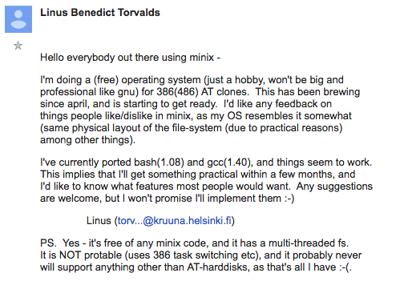

# Digital economy

Welcome!

---

## Introduction

---

Plan for the day

- open-source and the commons
- the role of the platforms and the life below the API
- the blockchain
- work on individual commentaries

---

## Peer production

---

What is Linux?

---

an operating system that is the result of the global, non-commercial distributed workforce.

- 85% of all smartphones
- 96% of all websites
- 4.5% of all laptops

<!--

Linux is an operating system, meaning that it is a crucial piece of software which orchestrates the relation behind other software and hardware.

for instance, if you're listening to spotify, spotify needs to have access to your speakers. if you're getting a facetime call at the same time, the operating system tells spotify to smoothly fade out the music, and hand over access to the speakers to facetime.

other operating systems are microsoft's windows and apple's macOS

-->

---

Available [for anyone to inspect and download](https://github.com/torvalds/linux).

<!-- Linux is the most widely-used operating system in the world, with both an incredibly democratic aspect (the cheapest Android phones on the planet run on Linux) and specific (every single one of the top 10 supercomputers in the world run Linux). It's also the only operating system running on the International Station, and the only operating system which went to Mars.

The intersection of all these domains is due to very special conjunction: Linux is both amongst the best operating systems, and the cheapest.

As the flagship example of open-source, it also represents a new way to create value in an information economy. -->

---

Linux is both __open-source__ (anyone can use it, but conditions apply) but also __free software__ (anyone can use it).

The distinction lies on whether we consider __software as a commodity__ or __software as an idea__.

<!--

On one side, open-source retains some rights for use and distribution of the software (with possibly still traditional licenses), while free software doesn't have any conditions attached to it, except that anything created with its help should also be made publicly available.

Free software's approach is that there is no real reason for an economic incentive to be required when it comes to making software; people made software before it was commercial, and arguably people make better software when it is not commercial.

Related is how the software is built: both involved decentralized collaboration, but can still have a core team of contributors.

Some of the advantages to using open-source software is the externalization of costs. The disadvantage is the dependency on external factors.

-->

---

Bill Gates thought that software should be a commodity[^ref-gates].

[^ref-gates]: Gates, William Henry III, _An Open Letter to Hobbyists_, New York Times, 3 Feb 1976. <https://archive.nytimes.com/www.nytimes.com/library/cyber/surf/072397mind-letter.html>

<!--

Up until Gate's letter, the costly thing was the hardware. Software was an afterthought and, anyways, it was so easily reproducible, and so focused on a specific machines that it didn't really make sense to try to limit its circulation.

With the advent of operating systems, software could be used across machines, and therefore gained value. The challenge was now to protect it against piracy.

-->

---

When faced with a new technology, should the economic model adapt to this change, or should the technology adapt to the economic model?

<!-- This is the overarching question -->

---

### Wikipedia

---

Wikipedia is a form of online __commons__.

<!-- The story behind Wikipedia is that of the surprise that a lot of people responsible in a distributed manner are much more efficient than a few, centralized ones. See [the story of Wikipedia's predecessor](https://en.wikipedia.org/wiki/Nupedia).

However, for such an organizational model to improve, one needs to adapt the rules. Indeed, Wikipedia's editing practices are very different from that of an academic journal. -->

---

elite knowledge vs. crowd knowledge

what are reasons to edit wikipedia?

---

Elinor Ostrom showed how economic governance can be shared over common resources[^ref-ostrom].

[^ref-ostrom]: Ostrom, Elinor. _Governing the Commons: The Evolution of Institutions for Collective Action_. Cambridge: Cambridge University Press, 2015. Print. Canto Classics.

<!-- 

While first coming into the spotlight with the article "Tragedy of the Commons", commons is that which belongs to all: ideas, sunsets, water, air, etc. The question then arises regarding how do we manage these? Based on Harding, the assumption was that commons was a doomed endeavour, since humans are essentially selfish (see: game theory & the prisoner's dilemma). However, Ostrom led an empirical study on how fisheries (also commons) were managed by fishermen and won a Nobel Prize for her work on commons management, highlighting 8 principles—spoiler: people manage their commons quite well.

In the cultural sense, commons took a different turn when articulated with communication technologies. The commons now had a possibility to be manifested in different areas. One of these areas is, for instance, the circulating of academic materials amongst the public.

Commons-based peer-production of value is a term coined by Yochai Benkler. It is due to the falling costs of production means that digital information goods are increasingly produced in lieu of market compensation and property incentives. In other words, because individuals require so few resources to contribute to informational projects, they do not expect payment or property rights. Individuals essentially ‘gift’ their knowledge and informational labor to the public on sites including Wikipedia in return for ‘psychological well-being and gratification’ and ‘social connectedness’. For Benkler, this is nothing short of a new non-market and cooperative mode of producing economic value that is transforming Adam Smith’s The Wealth of Nations into The Wealth of Networks.

-->

---

- Define clear group boundaries.
- Match rules governing use of common goods to local needs and conditions.
- Ensure that those affected by the rules can participate in modifying the rules.
- Make sure the rule-making rights of community members are respected by outside authorities.
- Develop a system, carried out by community members, for monitoring members’ behavior.
- Use graduated sanctions for rule violators.
- Provide accessible, low-cost means for dispute resolution.

<!-- The rules for governing commons -->

---

There is a general movement of peer-production in the economic sector[^ref-benkler].

- linux
- wikipedia
- seti@home
- slashdot
- distributed proofreaders (gutenberg project)
- openstreetmap / google maps
- firefox

[^ref-benkler]: Benkler, Y. (2016). Peer production, the commons, and the future of the firm. Strategic Organization, 15(2), 264-274. https://doi.org/10.1177/1476127016652606

---

commons-based peer-production has some limits:

- need for monetary compensation
- emotional involvement is much higher than in regular production
- spontaneous movements must become organized to survive -> benevolent dictator
- only focuses on highly rigid systems[^ref-kreiss]
- lack of explicit inclusivity and accountability (leading to, e.g. [wikipedia feminist edit-a-thon](https://www.newyorker.com/tech/annals-of-technology/a-feminist-edit-a-thon-seeks-to-reshape-wikipedia))

[^ref-kreiss]: Kreiss, Daniel, Finn, Megan, Turner, Fred. _The limits of peer production: some reminders from Max Weber_. New Media & Society, 13(2). <https://doi.org/10.1177/1461444810370951>

---

### JSTOR

<!-- One example of the economic model resisting to technological change __JSTOR__. -->

---

__rival__ and __non-rival__ goods

<!--

rival: if i take some, you lose some

non-rival: if i take some, you don't lose anything

Both the consumption and creation of culture were heavily influenced by other technological advances which weren't related to communication technology (i.e. the internet). It stands in the wake of similar technological revolutions, such as the printing press (for books) as well as the gramophone (for music) and the film (for visual arts). As such, it is not so much the internet, but the computer which enabled a new way of doing things; with computing, it became incredibly easier to receive, create and distribute user-generated content. -->

---

copyright was established to __foster the advancement of arts and sciences__.

effectively, publishing associations and para-organizations reap the most benefits.

<!--

To protect the invention of an individual, to act as an incentive to put in the work to "advance the arts and sciences".

-->

---

from [aaron swartz](https://en.wikipedia.org/wiki/Aaron_Swartz) to aleksandra elbakyan (creator of [sci-hub](https://en.wikipedia.org/wiki/Sci-Hub))[^ref-guardian]

[^ref-guardian]: Buranyi, Stephen, Is the staggeringly profitable business of scientific publishing bad for science?, The Guardian, June 2017. <https://www.theguardian.com/science/2017/jun/27/profitable-business-scientific-publishing-bad-for-science>

<!--

Universities pay [too much](https://www.zmescience.com/research/how-much-for-journal-subscription-universities-pay-543564/) for journal fees, even though the researchers writing them are not paid, nor are the reviews.

-->

---

---

---

<!-- For the role of YCombinator in Silicon Valley, see this piece on [Paul Graham](https://davekarpf.substack.com/p/paul-graham-and-the-cult-of-the-founder) -->

---

## Ownership over access

---

In order to preserve revenue of copyright, iTunes pioneered the change by making copy hard, and associating users with accounts.

<!--

Is it stealing if the original owner doesn't lose their copy? The criminalization of computers and computer use, the downloading and uploading of copyrighted files, came at a moment when the entertainment industry failed to adjust to the new modes of distribution. It is with the advent of iTunes, and Digital Rights Management (DRM), that it became possible to enforce copyright law as it existed. In parallel with these DRM tools, the development of streaming, and thus the rise of lending over owning switched the market; it is now more important to have access to something, rather than to own it.

So copyright in itself is not technically censorship, as the only reasons for copyright to exist are monetary profit and "the advancement of the arts", but copyright holders were the first to show that you can tie someone's digital identity to someone's legal identity. This is what iTunes did: you have a digital product tied to your account.

On the one side, the MPAA and RIAA are preserving profit. On the other side, copyrighted content does generate value

as a response, copyleft licenses emerged to preserve the right to copy, remix and re-use:

- creative commons
- GNU public license
- Open Access

-->

---

Existing copyright laws is fundamentally against computers[^ref-doctorow] since __computers are low-cost copy machines__.

[^ref-doctorow]: Doctorow, Cory. The Coming War on General Computation, IETF, 2012. <https://archive.ieet.org/articles/doctorow201201.html>

<!-- The battle for copyright today is also the battle for the freedom of information. Because computers are by definition copying machines, making them more restrictive stifles their overall abilities (technical drawback) and because the penalties are so huge for copyright infrigements (legal drawback) that all actors would rather be overshooting their censorship target than undershooting their censorship target.
-->

---

## Platform economy

---

What is a platform?

<!--

facebook
instagram
uber
reddit
twitter
ebay
craigslist

-->

---

platforms are technical intermediaries organizing access to services and products between its users.

- use of information brokerage for the creation of value
- use of technical systems to reconsider the conditions of work
- reliance on __the network effect__

they don't create content, they create __conditions for the creation of value__.[^ref-gillespie]

[^ref-gillespie]: Gillespie, T. (2010). The politics of ‘platforms’. New Media & Society, 12(3), 347-364. https://doi.org/10.1177/1461444809342738

<!--

but it's also a term that gets deployed strategically.

a platform is an infrastructure which connects different actors (most often, sellers and buyers), and therefore has a unique economic component, and depends heavily on the network effect (the more people use it, the more attractive the platform becomes).

It also has a governance component: it decides how users should interact with one another.

Finally, it has a cultural impact: it changes how users behave in their lives and interactions with one another (twitter, tiktok, etc.)

-->

---

platforms are the only ones who have [full visibility](https://www.vice.com/en/article/ubers-god-view-was-once-available-to-drivers/), but eschew responsibility as being only middlemen.

<!-- they have had an impact on the development of markets: connecting everyone, and therefore redistributing power and agency (no middle-management, for instance, in uber).

Particularly, information asymmetry is a significant issue. Because platform users are always individualized, they are the only ones who have full visibility of the ecosystem, and therefore can manipulate it at their own advantage:

amazon market place promotes its own products

apple store arbitrarily allows access to publishers

spotify includes tracks in their sponsored playlists

uber forces drivers to work longer than they want through gamification mechanics -->

---

the value creation is co-opted by platforms through:

- information asymetry
- monopoly
- data profiles

---

## Cookies for the Oracle

---

what are cookies?

---

unique text identifiers that build up profiles across websites and services

<!-- The way cookies work, is that they store information on your browser, to remember you when you switch tabs, when you close your browser, when you shutdown your computer, etc.

They can be used by companies such as Facebook, via their Pixel, or Google, via their AdNetwork, to build up information on what you do online, and thus a consumer profile. These are then packed up by middle-companies, sold to Oracle for their Data marketplace, and then used by advertisers to choose which ad to show you on your next visit.
-->

---

behaviour [within platforms](https://nypost.com/2016/08/24/98-very-personal-secrets-facebook-knows-about-you/) extends across platforms.

<!-- Particularly through the facebook pixel -->

---

oracle is the [data marketplace](../oracle-data-cloud-data-directory.pdf).

---

the oracle is the one that _predicts_.

<!--

Prediction is something humans have yearned for at all times, especially for governance. This is what big data promises to do (e.g. predictive policing, or recommender algorithms).

But in reality, this big data allows for real-time management rather than true anticipation.

-->

---

## Working below the API

---

what all platforms have in common is an API, it's their real product.

API is an _Application Programming Interface_, it's a very broad term to denote __an interface between two or more systems__.

<!-- For instance, the keyboard on your phone is an API to different sets of characters, which you can configure however you want. -->

---

<https://api.deliveroo.com/restaurant/09287328y238746234fd/menu/kebab?value=21>

<https://api.uber.com/rides/23097uih34ifuh238723/request?start=menton&end=nice&surge=true>

<!-- This is how you really order a pizza from deiveroo, or a driver from uber -->

---

the intermediary becomes just technical apparatus

and creates __jobs below the API__

<!--

Typically, Uber or AirBnB are in the business of providing APIs to drivers/riders, or guests/hosts.

The bizarre point is that this is when code directly controls humans. We start to have a direct conflict of interest between the strive for software to be optimized and the need for humans to be respected. We've moved from Charlie Chaplin's cogs to Lidl's voice commands.

-->

---

platforms replace individuals and delegate responsibility by shifting them to users (both clients and producers).

<!--

some of the tasks that have shifted include management and evaluation.

-->

---

This is the technical component facilitation the __uberization of the economy__, with access over ownership, flexibility over structure, individual over collective.

---

Still, legislation can work:

- GDPR addresses the cookies and data profiles
- [Digital Markets Act](https://digital-markets-act.ec.europa.eu/about-dma_en) addresses the monopoly and asymetry of power

<!--

In the end, platforms are very much still dependent on legislation (which is why they spend so much money on either lobbying or voluntary spending on social contributions).

These legislations will make Uber and co. comply. The biggest challenge now in the EU is not the legal framework, but the actual application. Right now, it's limited to the country hosting the company, and this country is usually Ireland which, for tax reasons, doesn't want to prosecute too harshly. As a response, the EU is has enacted the Digital Markets Act to regulate competition and consumer rights.

-->

---

## The blockchain

---

the blockchain supports bitcoin by solving the __double-spending problem__[^ref-nakamoto]

[^ref-nakamoto]: Nakamoto, Satoshi, _An electronic peer-to-peer- cash system_, 2004. <https://bitcoin.org/en/bitcoin-paper>

---

a blockchain recreates the uniqueness that computation gets rid of. it __recreates scarcity__.

what is it good for?

---

- bypassing centralized institutions
- enforcing the uniqueness of a document
- money trail

<!--

Alternative cash systems are useful if the US doesn't like you.

-->

---

## Individual commentaries

---

Find one piece of research regarding your topic (long-form article, research paper, executive report).

Read it, write a commentary on it (analyzing context, thesis, arguments, blind spots).

Then upload it to your favorite LLM, and prompt it to do the same.

Paste the output to your webpage, and comment on it. How good was it? What did it find, what did it miss?

1. link to the article
2. your commentary
3. the llm's commentary
4. your commentary on the llm's commentary

---

## Outro

---

Digital communications create new modes of production.

Older forms of ownership fought back, and shifted to __access__.

Large companies have made vast amounts of money by being platforms, building up data consumer profiles in the meantime.

These platforms redistribute agency by switching to a machine-machine interaction via APIs.

---

Next time, we will talk about the quest for artificial intelligence.

- read [Mattu, Julia Angwin, Jeff Larson,Lauren Kirchner,Surya. “Machine Bias.” ProPublica, 2014](https://www.propublica.org/article/machine-bias-risk-assessments-in-criminal-sentencing).
