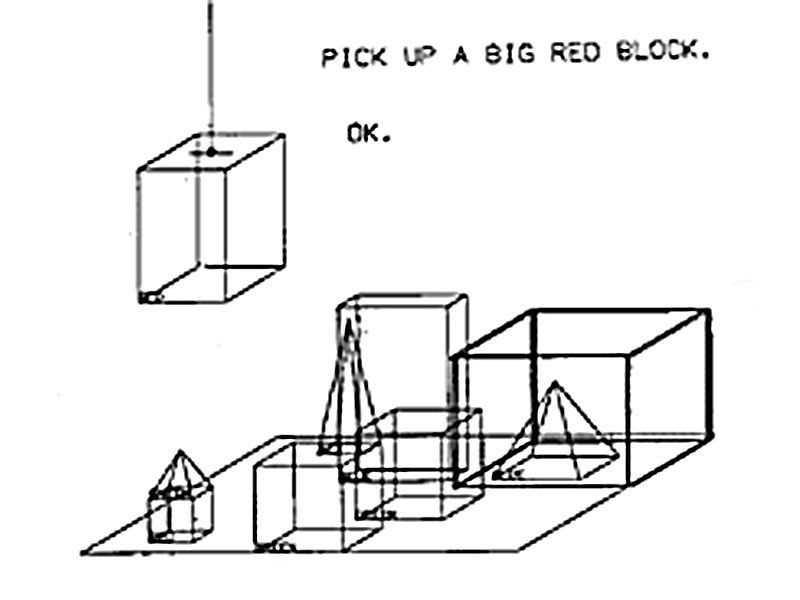
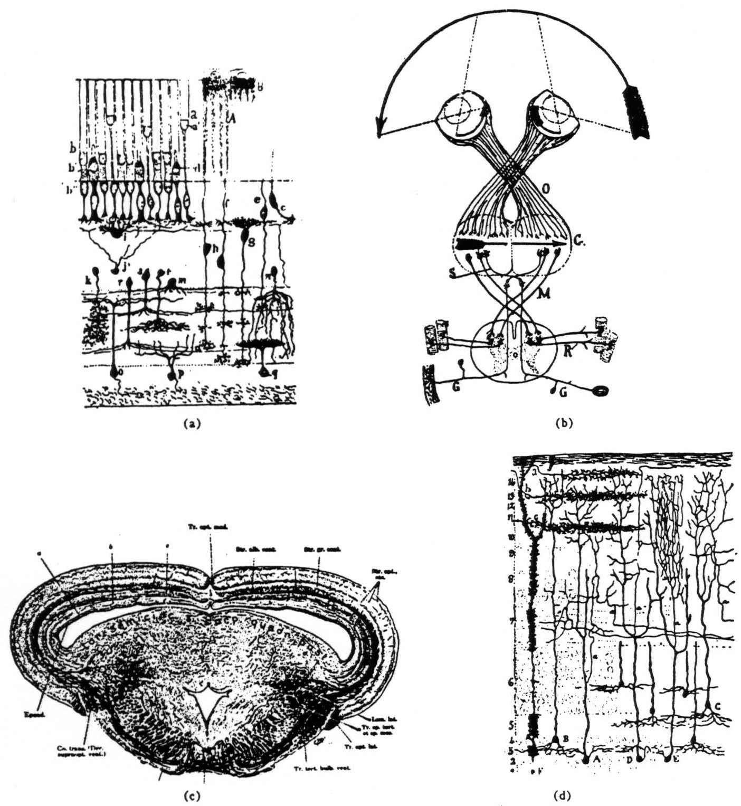

# Artificial intelligence

Welcome!

<!-- This session focuses on the history and perspectives of developing AI techniques, from 1950's Turing Test until today's large language models.
-->

---

## Introduction

---

Plan for the session:

- hypes of artificial intelligence (up to ChatGPT)
- intelligence as symbolic reasoning
- intelligence as probabilistic deciding
- group work on format

---

do you think we should use an AI software in the court room?

<!--

The question of AIs in courtrooms suggests different trains of thoughts:

- AI offers an approach to standardization to guarantee equal treatment
- AI developed in a business setting cannot offer due process due to being a trade secret
- A combination of both humans an AI might be the best way to go forward

For an overview of why it might not be a good idea, see Garapon, Antoine, and Jean Lassègue. Justice Digitale: Révolution Graphique et Rupture Anthropologique. 1re édition, Presses universitaires de France, 2018.

-->

---

what is AI?

---

## Cultural contexts

---

Between short and long histories: humans have always told stories of animated matter.

[Talos](https://en.wikipedia.org/wiki/Talos), [Frankenstein's monster](https://en.wikipedia.org/wiki/Frankenstein%27s_monster), [Pygmalion's statue](https://en.wikipedia.org/wiki/Pygmalion), [Golem](https://en.wikipedia.org/wiki/Golem).

<!-- These creatures are all ways to represent something else. Talos represents the laws of the gods. Frankenstein's monster represents the hubris of man, Pygmalion represents fascination for perfection, and the Golem has shifted in its associations, including war, community, isolation, hope, and despair. -->

---

Historically, artificial life was associated with __movement__. The shift to __language__ happens with the 1913 play [Pygmalion](https://en.wikipedia.org/wiki/Pygmalion_(play)).

---

Already anthropomorphisation: would machine intelligence be similar to human intelligence?

<!-- Anthropomorphisation is the process of ascribing human-like properties to non-human things (e.g. referring to ChatGPT as "he" or "she") -->

---

Collective automation as intelligent machinery: from automatising the pin factory of Adam Smith[^ref-smith], to Leonardo Flores' Cybersyn[^ref-cybersyn] in Chile.

[^ref-smith]: See how the story of the pin factory is fundamental to a theory of the division of labor: https://en.wikipedia.org/wiki/Division_of_labour#Adam_Smith

[^ref-cybersyn]: See https://en.wikipedia.org/wiki/Project_Cybersyn

<!-- Additionally, AI research also includes multi-agent systems, in wich groups of small, limited reasoning agents can give rise to complex behaviours (likes ants, bees or birds) -->

---

The person who sets the bar we deal with today is Alan Turing with his Turing Test[^ref-turing].

[^ref-turing]: Turing, Alan M. “Computing Machinery and Intelligence.”,Mind, 1950. <https://redirect.cs.umbc.edu/courses/471/papers/turing.pdf>

---

can one tell apart a man and a woman? a human and a machine?

- the difference between being and appearing (cop-out)
- the role of education (already)
- the mind/body duality

<!-- In the process of trying to imitate an adult human mind we are bound to think a good deal about the process which has brought it to the state that it is in. We may notice three components:

(a) The initial state of the mind, say at birth,

(b) The education to which it has been subjected,

(c) Other experience, not to be described as education, to which it has been subjected.

Turing starts by asking the question of whether we could ever tell apart a robot from a human, if we could only talk to them via a computer interface (i.e. texting). This is the first standard of intelligence that is put forward. -->

---

AI research is both a __technical__ endeavour and a __philosophical__ endeavour.

---

## Symbolical reasoning

---

### Hype #1 - the symbolical

---

The assumption that language is best language to solve all things, dating all the way back from Leibniz[^ref-principia-mathematica].

[^ref-principia-mathematica]: See the genealogy of that idea in Linsky, Bernard, and Andrew David Irvine. “Principia Mathematica.” The Stanford Encyclopedia of Philosophy, Metaphysics Research Lab, Stanford University, 2022. <https://plato.stanford.edu/archives/spr2022/entries/principia-mathematica/>.

---

Seeing programming as a mathematics automated, people prove to automate intellience[^ref-dartmouth].


[^ref-dartmouth]: See the original proposal for the first AI workshop <https://raysolomonoff.com/dartmouth/boxa/dart564props.pdf>.

---

It focuses on linguistic __toy problems__ (e.g. understanding children's stories, or solving mathematical problems).

Games are also good examples.

---



<!--

The first approach to AI starts in 1956, with the coining of the term "Artificial Intelligence" by a bunch of mathematicians at Dartmouth. They assume that one can represent the mind through abstract concepts and connections.

SHRDLU focuses on an atomistic conception of language, inspired by Chomsky. It also became famous because of its __interface__. A technological innovation needs to impress at first sight.

-->

---

### Criticism #1 - ELIZA

---


---

The criticism of [ELIZA](https://www.masswerk.at/elizabot/), the first conversational agent (1964-1967).

```txt
- ELIZA: how are you feeling today?
- PATIENT: i'm feeling sad
- ELIZA: why are you feeling sad?
- PATIENT: because of some dumb thing
- ELIZA: what kind of dumb thing?
```

<!--

ELIZA was the first language-processing program which could converse with humans. Even though it was designed to show the superficiality of human-machine conversations, it nonetheless caused a sensation in the general public.

You can find more technical details here: <https://dl.acm.org/doi/10.1145/365153.365168>, and a critical analysis here: <https://ojs.weizenbaum-institut.de/index.php/wjds/article/view/106>

-->

---

Should we use an AI as a therapist?

---

A first question of ethics: __just because we can, does it mean we should__[^ref-weizenbaum]?

[^ref-weizenbaum]: Weizenbaum, Joseph. _Computer Power and Human Reason: From Judgment to Calculation_. 1st edition, W H Freeman & Co, 1976.

<!-- The first criticism of this approach comes from Joseph Weizenbaum who, in his book [Computer Power and Human Reason](https://en.wikipedia.org/wiki/Computer_Power_and_Human_Reason) makes the difference between things that require choice, which a computer can do, and things which require judgment, which a computer cannot do. This is because the former is only calculation, while the latter is value based. 

He intends to show that machines can never be truly conscious by building one: the first chatbot, ELIZA. However, the illusion of intelligence remains and psychiatrists across the country reach out to him to use the robot in therapy. -->

---

### Winter #1

---

turns out, computers don't work so well in the real world. funders are disappointed.

1965s - 1975s

<!-- These debates take place exclusively in academia, where there is quite a lot of computing power to do these intelligence experiments. However, the private sector does not benefit from it, and the hype dies out. -->

---

### Hype #2 - Expert systems

---

AI rebrands itself as __expert systems__: restricted problem domain, specific rules, large knowledge databases, and adapting to the technocratization of western economies.

- SABRE (automated travel agent) - 1976
- MAVENT (mortgage and lending compliance automation) - 1980
- HFT (high frequency trading) - 1983

<!--

The second wave results in expert systems, which require more computing power, and in the formalization of complex rule systems, such as finding the cheapest airline ticket, calculating someone's mortgage, or deciding to buy or sell stock. Some of these systems still exist today, but the normalization of their use makes them less prone to being qualified as "AI".

-->

---

### Criticism #2 - Chinese room

---


<!--

The second criticism aims at the fallacy of representing knowledge as rules. John Searle proposes an experiment to illustrate it: [the chinese room paradox](https://en.wikipedia.org/wiki/Chinese_room)

-->

---

### Winter #2

---

But there are limits to __cathedrals of rules__[^ref-cardon].

[^ref-cardon]: Cardon, Dominique. Mazières, Antoine. _Neurons Spike Back_, Réseaux, vol. 28. 2018. <https://hal.science/hal-02190026v1/file/NeuronsSpikeBack.pdf>

---

Still, computers are still good at playing video games.


<!--

The summit of the logical/big hardware approach is when IBM builds a computer which manages to beat Kasparov, chess grandmaster. However, one might think it's only a fairly restricted conception of intelligence.

That is, computer scientists thinking that playing chess is being intelligence is a methodological bias since computer scientists probably already like playing chess and consider themselves intelligent.

-->

---

## Connected intelligence

---


Along with the __symbolist__ approach to artificial intelligence, was a __connexionist__ approach.

<!--

There is another alternative to the development of AI: rather than logical of few, complex concepts, one can also take a huge amount of somewhat simple concepts.

This is a more physiological approach, one which aims at mimicking not the abstraction of the mind, but the reality of the brain.

-->

---



It turns out that __sensing is also thinking__[^ref-lettvin].

[^ref-lettvin]: Lettvin, J. Y., et al. “What the Frog’s Eye Tells the Frog’s Brain.” Proceedings of the IRE, vol. 47, no. 11, Nov. 1959, pp. 1940–51. IEEE Xplore, https://doi.org/10.1109/JRPROC.1959.287207.

---

Embodiment and perception might be essential to intelligence (cf. [Moravec's Paradox](https://en.wikipedia.org/wiki/Moravec's_paradox))

---

## Leanring by examples

---

In the 2000s, __machine learning__ really picks up, with the help of __data__, __hardware__ and __adaptation__.

<!-- really appeared with better hardware and better data (machine learning, convolutional neural networks) -->

---


<!--

The only thing that was missing was big data: now that there is a large amount of regular data, we can pay attention to a different kind of intelligence.

For instance: how come it's super easy for humans to recognize images, and very hard for computers? So the process of [deep learning](https://en.wikipedia.org/wiki/Deep_learning) works very well with large amounts of data to do trial and error deductions.

Because, ultimately, it is this trial and error approach which is a fundamental shift: intelligence systems are no longer inductive, they are deductive.

instead of inductive reasoning (i.e. knowing the rules beforehand), you go for deductive reasoning (i.e. you figure out the rules as you go).

aka you show tens of thousands of examples to an algorithm and it adapts.

-->

---

For linguistic data (chains of characters), we turns __words into vectors__[^ref-tutorial].


[^ref-tutorial]: For an explanation of how this works, see: https://jalammar.github.io/illustrated-word2vec/

<!--

word vectors: the cool thing. information retrieval, creating a semantic space to be searched

-->

---

We get all these words from the Internet[^ref-common-crawl], and sometimes it's not the best representation of the world[^ref-programmer-homemaker].

[^ref-common-crawl]: See Common Crawl <https://commoncrawl.org/>

[^ref-programmer-homemaker]: Bolukbasi, Tolga, et al. “Man Is to Computer Programmer as Woman Is to Homemaker? Debiasing Word Embeddings.” arXiv:1607.06520, arXiv, 21 July 2016. arXiv.org, https://doi.org/10.48550/arXiv.1607.06520.

---

> You shall know a word by the company it keeps[^ref-firth].

We figure out what a word means through its neighbors, and [represent it in space](https://projector.tensorflow.org).

[^ref-firth]: Firth, J. R. “Applications of General Linguistics.” Transactions of the Philological Society, vol. 56, no. 1, 1957, pp. 1–14. Wiley Online Library, https://doi.org/10.1111/j.1467-968X.1957.tb00568.x.

---

The most recent advance is the __Transformer__ architecture, which adds a dimension of __attention__ (which words are more relevant to others?)[^ref-attention].

[^ref-attention]: See _[Attention is all you need](https://arxiv.org/abs/1706.03762)_, Google, 2017

<!--

In 2017, Google releases a paper which combines this word-to-vector representation with a linear development: basically, they have an algorithm which can guess the next word in a sentence, and turns out it's very effective!

This solved the problem of indeterminate semantics (which words refers to what).

-->

---

__Stable Diffusion__ focuses on pattern recognition from noise, which itself includes numerical information from __latent space__.

---

Finally, the magic touch of the interface: from autocomplete to chatGPT.


<!-- Interfaces and test cases frame our understanding of what a new technology is. -->

---

The paradox of __ridiculous efficiency__ and __epistemic abyss__.

i.e. it works very well, but we don't know why. Now what?

---

There is a new technology.

- Should it be applied indiscriminately?
- How do we distinguish between marketing and reality?
- What are the first and second order consequences?
- Is it [culturally biased](https://www.moralmachine.net/)?

---

## Outro

---

Artificial Intelligence research is both a __philosophical project__ (what is intelligence?) and an __engineering project__ (how do we make something behave intelligently?).

So far the second one has had a lot more success. We tried to reason about it, but in the end we learn by example.

The overwhelming amount of money invested in AI fuels a current investment bubble, and makes it hard to disentangle truth from sales pitch.

---

Last meeting will be online, with each group: 12/09.

Deadline for digital inquiries: 19/09.
