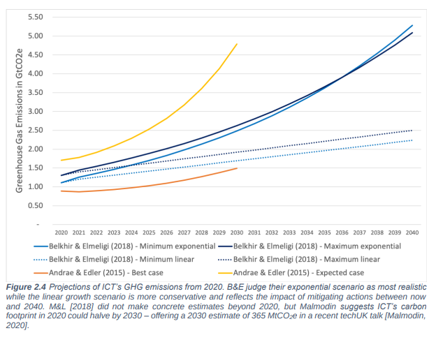
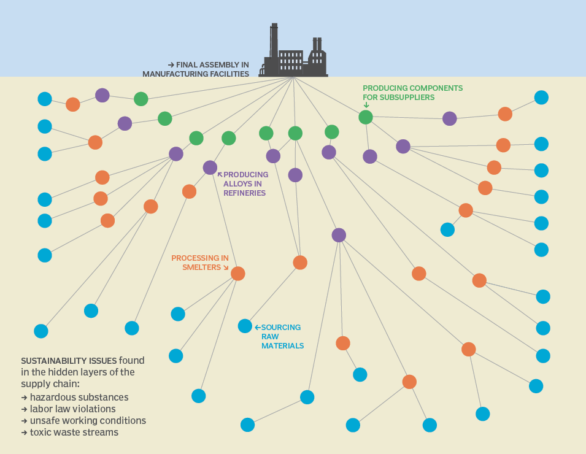
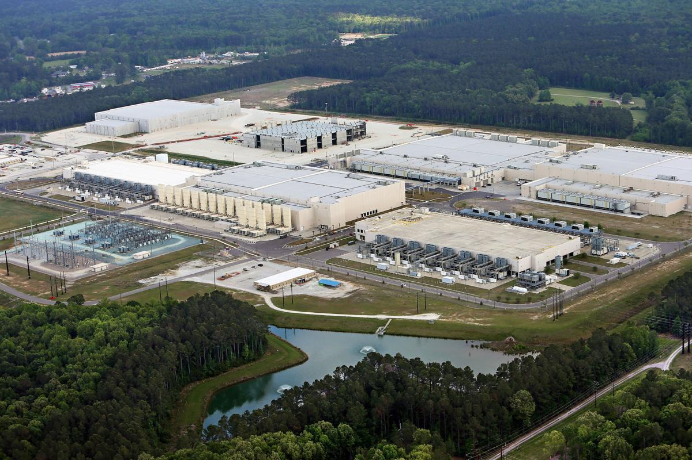
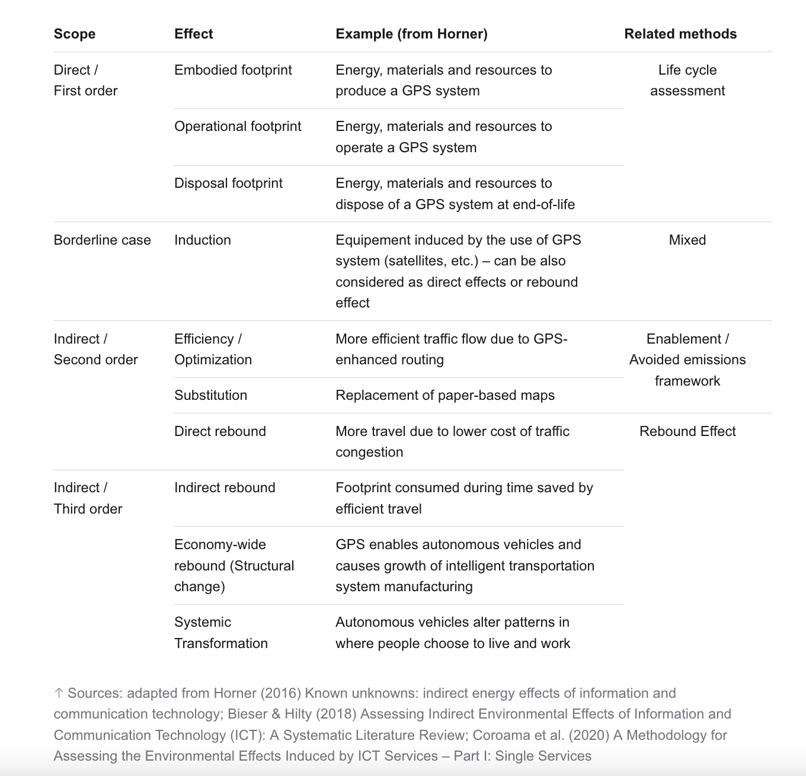
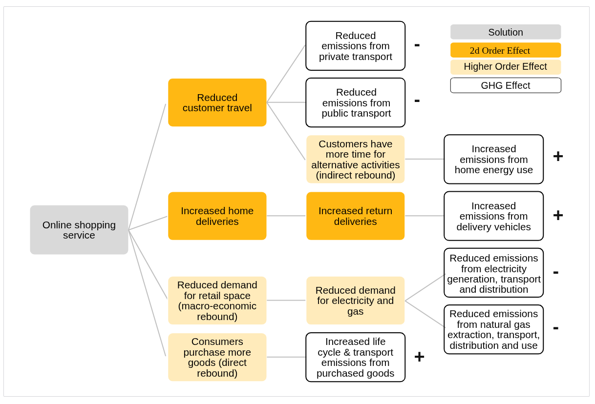
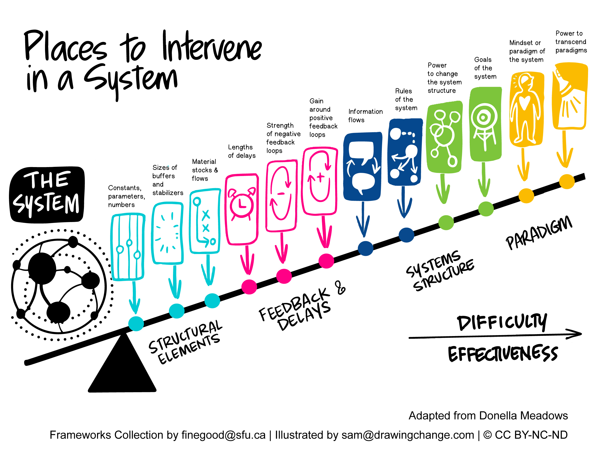

# Digital climate

Welcome!

<!-- This session, we look at the environmental impacts of the digital industries -->

---

## Intro

Last time, we talked about artificial intelligence, and the rise of GPTs due to the increase in data and hardware.

---

Plan for the day

- Digital footprints
- A tale of two transitions
- Low-tech
- Group work

---

What is the environmental toll of a Netflix binge?

---

## Software impact

---

A webpage is about 5,000 Kb.

An HD series episode is about 7,000,000 kb.

<!-- The first immediate problem with this the increase in the amount of data being transferred. Streaming in HD is more than streaming in SD. And we've been streaming more and more. -->

---

Streaming moved from __adapting to bandwidth restriction__, to bandwidth __adapting to streaming's desires__[^ref-frankenstream].

[^ref-frankenstream]: See the _Frankenstream_ documentary here: https://www.youtube.com/watch?v=Qy2Skc7NLVU

---

In 2009, the IT sector surpasses air travel in CO2 emissions[^ref-gartner] (between 1.7% and 4%).

[^ref-gartner]: See this World Bank report: https://documents1.worldbank.org/curated/en/099121223165540890/pdf/P17859712a98880541a4b71d57876048abb.pdf

---

And it keeps growing[^ref-growth-ict] (4% a year, while global emissions are declining).

[^ref-growth-ict]: See, Charlotte Freitag, Mike Berners-Lee, Kelly Widdicks, Bran Knowles, Gordon S. Blair, Adrian Friday. _The real climate and transformative impact of ICT: A critique of estimates, trends, and regulations_, 2021. <https://www.sciencedirect.com/science/article/pii/S2666389921001884>

<!-- Nathan Ensmenger argues the history of computing was always about extracting and managing resources, see Ensmenger, Nathan, _The Environmental History of Computing_, Technology and Culture, Volume 59, Number 4 Supplement, October 2018, https://homes.luddy.indiana.edu/nensmeng/files/Ensmenger2018.pdf  -->

---

Data centers' energy requirement could double by 2026, represent 7-12% of total U.S. domestic consumption[^ref-doe]

[^ref-doe]: See this Department of Energy report: https://www.energy.gov/articles/doe-releases-new-report-evaluating-increase-electricity-demand-data-centers.

<!--

The report from the DoE referenced mentions: "The report finds that data centers consumed about 4.4% of total U.S. electricity in 2023 and are expected to consume approximately 6.7 to 12% of total U.S. electricity by 2028. The report indicates that total data center electricity usage climbed from 58 TWh in 2014 to 176 TWh in 2023 and estimates an increase between 325 to 580 TWh by 2028.

For instance, Microsoft has re-opened a nuclear powerplant reactor to power its AI needs: https://www.npr.org/2024/09/20/nx-s1-5120581/three-mile-island-nuclear-power-plant-microsoft-ai

-->

---

Lifecycle breakdown of the emissions[^ref-shift-project][^ref-roussilhe]:

- device manufacturing (factories)
- data centers (storing content, running algorithms)
- network infrastructure (delivering content)
- user-side operations (battery use)
- e-waste management (throwing things away)

[^ref-shift-project]: See the 2019 report from the Shift Project: https://theshiftproject.org/app/uploads/2025/04/Lean-ICT-Report_The-Shift-Project_2019.pdf

[^ref-roussilhe]: See Roussilhe, Gauthier, _Explaining the environmental footprint of the digital sector_, 2021. https://gauthierroussilhe.com/en/articles/explaining-the-environmental-footprint-of-the-digital-sector

---

---

<!-- For more information on how cobalt and coltan are essential to batteries, and what that means for the lives of people in Congo, see https://www.npr.org/sections/goatsandsoda/2023/02/01/1152893248/red-cobalt-congo-drc-mining-siddharth-kara -->

---

Device manufacturing is mainly done in China (for now, highly coal-intensive, might change).

---

---

It needs water for:

- itself (cooling)
- its electricity source (power and cooling)

<!-- And what it takes, it prevents others from using. For instance, in Ireland, data centers 11% of the electricity grid, and that puts the rest of the country under strain. -->

---

---

---

> Solutions to mitigate emissions include shifting to renewable energy, energy-efficient devices, circular economy principles, edge computing, green coding, and improved recycling practices. The ICT sector can significantly reduce its environmental impact and contribute to global sustainability efforts by adopting these solutions.

Beware of __the rebound effect__.

---

## A tale of two transitions

---

Is the digital transition supporting the climate transition?

<!--

This includes geo-engineering, nuclear, carbon capture, iot, smart city, etc.

Most assumptions is that the energy transition will be supported by the digital transition; that through dematerialization and efficiency gains, we will be able to live life as usual without having to fundamentally change lifestyles. See for instance https://www.ecomodernism.org 

Can we ever decouple from nature?

-->

- geo-engineering
- nuclear
- carbon capture
- iot
- smart city
- etc.

<!-- This very modernist approach, and technno-optimistic approach might have its limits. -->

---

<!-- See Gauthier Roussilhe, _Perspectives and Methodologies_ <https://gauthierroussilhe.com/en/articles/nouvelles-perspectives-de-recherche> -->

---

Changes of perception as we see the Earth through the digital[^ref-gabrys] [^ref-edwards].

[^ref-gabrys]: Gabrys, Jennifer. Program Earth: Environmental Sensing Technology and the Making of a Computational Planet. University of Minnesota Press, 2016. academic.oup.com, https://doi.org/10.5749/minnesota/9780816693122.001.0001.
[^ref-edwards]: Edwards, Paul N. A Vast Machine: Computer Models, Climate Data, and the Politics of Global Warming. MIT Press, 2013. Infrastructures.

---

Historically, there have been no "transitions", energy and material have only accumulated[^ref-fressoz].

[^ref-fressoz]: See Fressoz, Jean-Baptiste, _More and More: An All-consuming history of energy_, Harper, 2025.

---

It is also necessary to look at which point of the system are we operating[^ref-meadows].

[^ref-meadows]: See Donella Meadows, _Leverage Points: Places to Interverne in a System_, 1999 <https://donellameadows.org/wp-content/userfiles/Leverage_Points.pdf>

<!--

Donnella Meadows is the author of the landmark 1973 "[Limits to Growth](https://en.wikipedia.org/wiki/The_Limits_to_Growth)" report for the Club of Rome, which was the first systems-oriented study of global growth with regards to environmental limits.

Most of what we do in the lower part. But the higher part has the most leverage.

The goal of the system is profit.

One mindset change was "one apple iphone every year"

-->

---

Meanwhile, Apple used to force recyclers to shred Macbooks and iPhones, rather than re-use them[^ref-shred].

[^ref-shred]: Koebler, Jason, _Apple Forces Recyclers to Shred All iPhones and MacBooks_, 2017. https://www.vice.com/en/article/apple-recycling-iphones-macbooks/

<!--

Apple has managed to build up a mindset of "one iphone every year", or at least profits massively from it.

Even in the recycling process, half of the materials get lost due to the toxic chemicals used: https://www.ifixit.com/News/94386/the-truth-about-apples-free-iphone-recycling-program-the-earth-deserves-better

-->

---

> Repair and refurbishment should be supported, and smarter designs developed, to extend the lifetime of EEE. The easiest solution for all e-waste issues is still not to generate any e-waste in the first place.[^ref-global-ewaste]

[^ref-global-ewaste]: The Global e-waste Monitor, 2014.

<!-- Landfill < e-waste recyclng < re-use < repair -->

---

## Low-tech

---

A change of design, and a change of mindset.

---

The way forward is not __more efficient__, but __less greedy__.

---

Direct, individual servers sharing solar resources: [website](https://solar.lowtechmagazine.com) and [servers](https://www.solarprotocol.net).

Sometimes, it's OK for things to turn off.

---

__Caring__ for things makes them tangible and precious[^ref-care], and depends on a __right to repair__[^ref-right-repair].

[^ref-care]: See this overview from Jerôme Denis et David Pontille: https://www.csi.minesparis.psl.eu/en/featured-articles/investigating-the-maintenance-and-repair-activity/ and their English book https://www.csi.minesparis.psl.eu/en/featured-articles/the-care-of-things-ethics-and-politics-of-maintenance/

[^ref-right-repair]: See the concept here https://en.wikipedia.org/wiki/Right_to_repair

<!--

Care and maintenance shifts perspectives on innovation (it is more complex than the genius inventor narrative, and involves other, often invisibilized, actors), on stability (things do not "magically" last, but they only do if we pay attention to them, if we think about prevention and cure as essential activities), and on material fragility (things, just like living beings, need attention if they are to last long).

Concretely, this translates into the adoption of Right to Repair directives (2024) in the EU. -->

---

In general, a low-tech approach:

- questions the intrinsic desirability of technological progress
- questions our needs (maybe they're just wants?)
- questions whether tech alternatives can exist without social alternatives

---

## Group work

<!-- time to do group work -->

---

Next steps:

- make sure you have updated your URL on [the document](https://docs.google.com/spreadsheets/d/1xV9OO8AwI1nApRhBfAVUGiZu2HOhsS3SDOFQPk682_Y/edit?gid=0#gid=0)
- individual commentary due on 05/09, 18:00
- each group meets online, week of 08/09
- final due date 19/09, 18:00

---

## Course wrap-up

<!-- All in all, there are few broad themes that we touched upon, as we looked at networked communications, computational governance, platform and peer-to-peer economies, artificial intelligence and climate impact. -->

---

> Technology is a kind of magic, but it's still made by humans.

<!-- a.k.a the cloud does not exist. Attention needs to be paid to the fact that there is a difference between what technology appears to be (mystical, magical) and its realities (socio-economic specific innovations) -->

---

> Algorithms are only as dangerous as the social contexts they support.

<!-- Algorithms and the digital have sometimes ushered in new ways to work, but they also inscribe themselves within broader contexts which then make these technologies appear to be good or bad (i.e. they work within social, economic and political contexts to which value judgments can be ascribed) -->

---

> There are more than a few consequences.

<!-- A technology does not have only positive or only negative outcomes. They are myriads of consequences that happen at the same time (e.g. depending on the people it applies to), and consequences that only unfold later (e.g. second-order effects, or indirect effects). -->

---

> Possibility is not intrinsic desirability.

<!-- The question of the ethics of technology, of what "good behaviour in society" is, is the question of whether what can be done is the same thing as what should be done. -->

---

> Change your passwords, reject cookies and use Sci-Hub.

<!-- You can also use adblockers, such as UBlock origin (as a browser extension). -->

---

Thanks!
